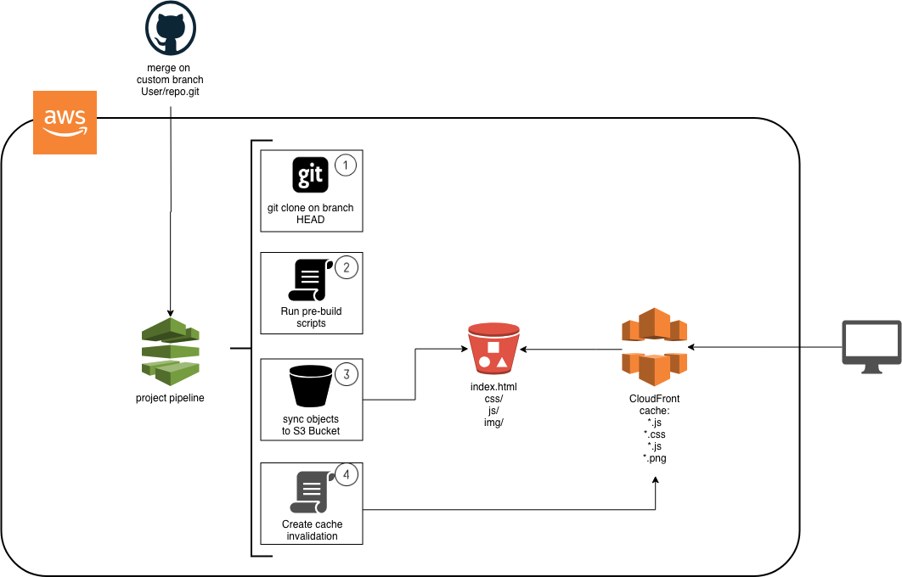

## CI / CD pipeline that can deploy and update a static site hosted on S3 as well as distribute that site to end users.

## 1. Stack

Issue | Technology
------------ | -------------
Git Manager | [Github](https://github.com)
Infrastructure Provisioning | [Terraform](https://www.terraform.io) - Hashicorp IaC Multicloud Manager
Pipeline / Build Platform | [CodePipeline](https://aws.amazon.com/pt/codepipeline/) + [CodeBuild](https://aws.amazon.com/pt/codebuild/) from AWS
Hosting System | [Amazon S3](https://aws.amazon.com/pt/s3/) -  Low Cost Object Storage with Website feature on AWS
Caching / CDN System | [Amazon Cloudfront](https://aws.amazon.com/pt/cloudfront/) - AWS Global Content Delivery Network


## 2. Basic Architecture



## 3. Project Configuration

Edit the `terraform.tfvars` file and input your account number, region, name of your app, github details (repo owner, repo, branch), Environment, etc.

Example:

```hcl
account_id            = "1234567890"
aws_region            = "us-east-1"
app_name              = "test-site"
git_repository_owner  = "Mamadoubalde"
git_repository_name   = "sample-static"
git_repository_branch = "master"
env_name              = "Development"
source_repo           = "https://github.com/Mamadoubalde/cicd-codepipeline-static-website"
developer             = "Mamadou Balde"
```

## 4. Edit your build specs

You can edit your build specs in templates/buildspec.yml

```yml
version: 0.1

phases:
  pre_build:
    commands:
      - echo Deploy website
  build:
    commands:
      - echo "add your steps and scripts here"
      - rm -rf .git
      - aws s3 sync --delete . s3://${bucket_name} --cache-control max-age=3600
  post_build:
    commands:
      - echo 'Invalidating distribuition cache'
      - aws cloudfront create-invalidation --distribution-id ${distribuition_id} --paths "/*"

```

## 5. Setup Github Access Token

* Create your Github Access Token to Command Line. [This link have all information about this](https://help.github.com/articles/creating-a-personal-access-token-for-the-command-line/).


* Export Github Token as an environment variable.

```bash
export GITHUB_TOKEN=YOUR_TOKEN
```

## 6. Validate and Deploy

* Initialize Terraform

```bash
terraform init
```

* Plan your modifications

```bash
terraform plan
```

* Apply the changes to AWS

```bash
terraform apply
```
